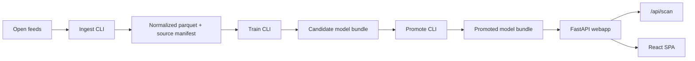

# BaitDetector

Phishing-first URL risk scanner with a local ML model and a repeatable ingest/train/promote pipeline.

Live app:
- `https://baitdetector.vercel.app`

This is a hobby project. The Vercel-hosted app is only a demo deployment; you can clone this repo and run the full stack locally with the bundled demo data and default SQLite setup.

## At A Glance
- Paste a URL and get a phishing probability, verdict, and risk band in one shot
- See which lexical signals pushed the score up or down
- Inspect the currently promoted model snapshot directly in the UI
- Backed by a repeatable open-data ingest, training, and promotion pipeline

## What You Can Try
- Check a login-looking URL and see whether the local model leans benign, suspicious, or phishing
- Compare obvious benign domains against synthetic phishing-style domains
- Open `under the hood` to inspect the shipped model snapshot, thresholds, and the latest ingest/train dates exposed by the app

## What The App Actually Does
- Scores one URL at a time and returns a phishing probability, verdict, risk band, reasons, and local threat-intel context
- Explains which lexical and n-gram signals pushed the score up or down
- Keeps scans local with no live enrichment calls against the scanned destination
- Stores only minimal operational metrics by default; it does not persist raw scanned URLs

## Architecture


## Stack
- Python 3.12
- FastAPI JSON API
- Vite + React + TypeScript + Framer Motion
- scikit-learn linear challenger set with char TF-IDF and lexical features
- SQLAlchemy with SQLite locally and Neon/Postgres-ready configuration via `DATABASE_URL`
- GitHub Actions for CI and scheduled automation

## Quickstart
```bash
python3 -m venv .venv
source .venv/bin/activate
pip install -e ".[dev]"
python -m baitdetector.ingest --demo
python -m baitdetector.train --training-path data/normalized/latest.parquet
python -m baitdetector.promote
cd frontend
npm install
```

Then run the app in two terminals:
```bash
# terminal 1
source .venv/bin/activate
python -m baitdetector

# terminal 2
cd frontend
npm run dev
```

Open `http://127.0.0.1:5173` for hot reload during UI development.

For production-style hosting from FastAPI, build the frontend first:
```bash
cd frontend
npm run build
cd ..
source .venv/bin/activate
uvicorn baitdetector.app:create_app --factory --host 127.0.0.1 --port 8000
```

Then open `http://127.0.0.1:8000`.

If you want the common flows behind one command, use the Makefile:
```bash
make install
make bootstrap-model
make dev
make test
make run
```

`make dev` starts FastAPI and Vite together with reload. `make run` builds the frontend first, then serves it from FastAPI via Uvicorn at `http://127.0.0.1:8000`.

## APIs That Can Be Served Externally
If you run the FastAPI app locally or host it yourself, these are the same routes the web app calls.

`POST /api/scan`

Request:
```json
{
  "url": "https://secure-paypa1-alert.xyz/login"
}
```

Response shape:
```json
{
  "normalized_url": "https://secure-paypa1-alert.xyz/login",
  "verdict": "phishing",
  "phishing_probability": 0.9731,
  "risk_band": "high",
  "reasons": [],
  "intel_hits": [],
  "model_version": "baitdetector-20260322T000000Z",
  "scanned_at": "2026-03-22T00:00:00+00:00",
  "deep_scan_status": "skipped"
}
```

`GET /api/model-info`

Returns the current model version, model id/family, training and benchmark windows, feature set, last training date, last ingestion date, runtime thresholds, and evaluation summary.

## Data Sources
| Source | Role | Cadence | Notes |
| --- | --- | --- | --- |
| Phishing.Database | Positive labels | Periodic snapshot feed | Primary open phishing source |
| PhishTank | Positive labels | Hourly | Secondary verified phishing source |
| Tranco | Benign labels | Daily | Popular-domain ranking used for benign sampling and rank context |

## Training Flow
1. `python -m baitdetector.ingest` downloads source feeds and writes raw snapshots plus `data/normalized/latest.parquet`.
2. `python -m baitdetector.train` uses timestamped `data/normalized/urls-*.parquet` history when at least 3 snapshots exist, trains a fixed linear challenger set, calibrates when validation data is large enough, and writes `training_summary.json` plus `leaderboard.json`.
3. `python -m baitdetector.promote` promotes only when the shared benchmark says the selected challenger beats the current promoted model without regressing PR-AUC, ROC-AUC, or benign false-positive rate.

Passing `--training-path` forces bootstrap mode on a single parquet or CSV file. That path is useful for local setup, but automatic promotion is skipped in bootstrap fallback mode.

The bundled `data/demo/demo_training.csv` is a synthetic starter corpus so the app is runnable immediately without waiting for live feeds.

## Snapshot History Contract
The weekly trainer only leaves bootstrap fallback mode when it sees durable normalized snapshot history. That history now lives on the dedicated `model-data` branch:

- `data/normalized/urls-*.parquet`
- `data/normalized/latest.parquet`
- `data/normalized/latest_manifest.json`

Retention policy:
- keep the latest 14 timestamped normalized snapshots
- never store `data/raw/**` on `model-data`

Operational flow:
- `nightly-ingest.yml` runs ingest and publishes normalized history to `model-data`
- `weekly-train-promote.yml` hydrates `data/normalized/` from `model-data`, runs one fresh ingest, trains, promotes when gates pass, asserts that the promoted bundle is complete, updates `model-data`, and commits `data/models/promoted/` back to the default branch

Promoted runtime bundles are treated as incomplete unless they contain:
- `model_bundle.joblib`
- `metadata.json`
- `training_summary.json`
- `leaderboard.json`

If `training_summary.json` is missing at runtime, `/api/model-details` falls back to building `feature_correlation` from bundled `data/normalized/latest.parquet`. In that fallback case, leaderboard data may be empty.

## Model Notes
- Core lexical features include URL length, entropy, suspicious tokens, subdomain depth, punycode, raw IP hosts, redirect parameters, shortener detection, Tranco bucket, and local phishing-feed recency.
- The weekly trainer compares exactly three linear challengers: baseline logistic regression, sparse L1 logistic regression, and SGD log-loss.
- Runtime phishing and suspicious thresholds now come from the validation split and are stored in model metadata exactly as the API uses them.
- The shipped artifact is still a bootstrap/demo model. Real quality depends on live ingest volume, ingest cadence, and benchmark discipline.
- The scanner is assistive security tooling, not a standalone allow/block control.
- External enrichment is intentionally out of scope in the current version and reserved for a future update.

See [MODEL_CARD.md](MODEL_CARD.md) for assumptions, limitations, and evaluation details.

## Automation
- `ci.yml`: installs the package and runs tests on push and pull request
- `nightly-ingest.yml`: downloads live feeds, prunes normalized history to the latest 14 snapshots, publishes it to `model-data`, and uploads debug artifacts
- `weekly-train-promote.yml`: hydrates normalized history from `model-data`, runs a fresh ingest, trains a candidate model, enforces promotion gates, asserts bundle completeness, commits any newly promoted runtime bundle into the repo, and republishes normalized history

## Repo Layout
```text
src/baitdetector/       application, model, and CLI code
data/demo/              synthetic starter dataset
data/models/promoted/   promoted runtime artifact
data/normalized/        latest local normalized snapshot and manifest
dev/                    notebooks, design references, and non-runtime assets
tests/                  unit, parser, model, and API tests
.github/workflows/      CI and scheduled automation
```

## One-Time Recovery
To repopulate promoted diagnostics after migrating to the repaired pipeline:

1. Seed the `model-data` branch with the current normalized files:
   ```bash
   python scripts/model_data_branch.py --repo-root . publish \
     --branch model-data \
     --keep 14 \
     --commit-message "chore: seed normalized snapshot history"
   ```
2. Trigger `Weekly Train Promote` manually from GitHub Actions.
3. Verify that `data/models/promoted/` on the default branch now contains:
   - `model_bundle.joblib`
   - `metadata.json`
   - `training_summary.json`
   - `leaderboard.json`

## Development
```bash
pip install -e ".[dev]"
python -m pytest
cd frontend && npm test -- --run
cd frontend && npm run build
```

## Disclaimer
BaitDetector is for research, demo, and workflow support. It should complement broader security controls, not replace them.
